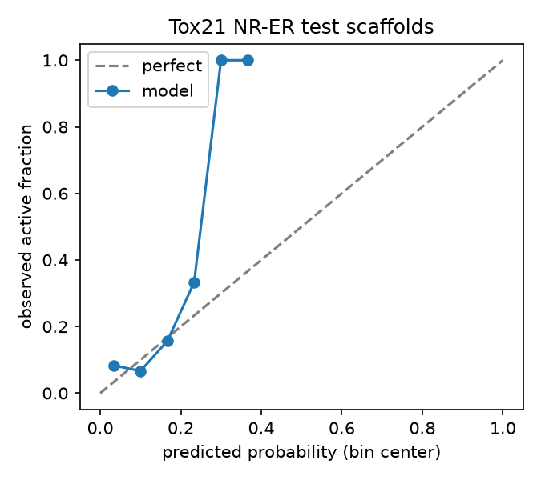

# mol-ml

[](https://github.com/barlowa124/mol-ml/actions/workflows/ci.yml)


Small-molecule machine learning over public datasets: toxicity, affinity,
docking. Three related projects merged into one repository, each a
self-contained package with its own tests and commit history (imported via
subtree merge).


## 60-second demo

```bash
cd comp_tox_pipeline && pip install -e .[dev]
snakemake --cores 4    # full split -> features -> fit -> report DAG (stubbed IO)
```




## Where this sits in the portfolio

`mol-ml` is the **small-molecule ML** repo: toxicity and affinity prediction on public datasets (ToxCast/Tox21, DAVIS) with scaffold/cold-target splits as the headline results. Sibling repos:
[trust-tools](https://github.com/barlowa124/trust-tools) (agent security
and evals), [bio-qc](https://github.com/barlowa124/bio-qc) (lab-data QC
pipelines), [lab-informatics](https://github.com/barlowa124/lab-informatics)
(lab data plumbing and integrity),
[llm-posttraining](https://github.com/barlowa124/llm-posttraining)
(training-stage behavior work),
[protein-ml](https://github.com/barlowa124/protein-ml) (protein fitness
ML), and [mol-ml](https://github.com/barlowa124/mol-ml) (small-molecule
ML).

## Packages

| Directory | What it does |
|---|---|
| `comp_tox_pipeline/` | Computational toxicology on EPA ToxCast/Tox21 + PubChem. Bemis-Murcko scaffold splits are the headline metric; conformal coverage and ECE reported on held-out scaffolds. |
| `dti_fusion/` | Drug-target interaction on DAVIS: fingerprint + ESM-2 fusion. Cold-target split is the headline result; random split labeled as target-identity leakage. |
| `dockops/` | Reproducible docking pipeline: batch ligand prep, Vina backend, mock engine for pipeline mechanics (labeled `engine="mock"` on every row). |

## Running tests

Each package is independent. From its directory:

```bash
cd comp_tox_pipeline && PYTHONPATH=src python -m pytest tests/ -q
```

Each subdirectory retains its own `AGENTS.md` with project-specific rules
(split policy, provenance requirements, mock-vs-real labeling), which still
apply.

## Why one repo

Same domain, same conventions. Public data only, structural splits as the
prospective estimate, provenance manifests on every result. One repo
keeps them consistent across three projects.
